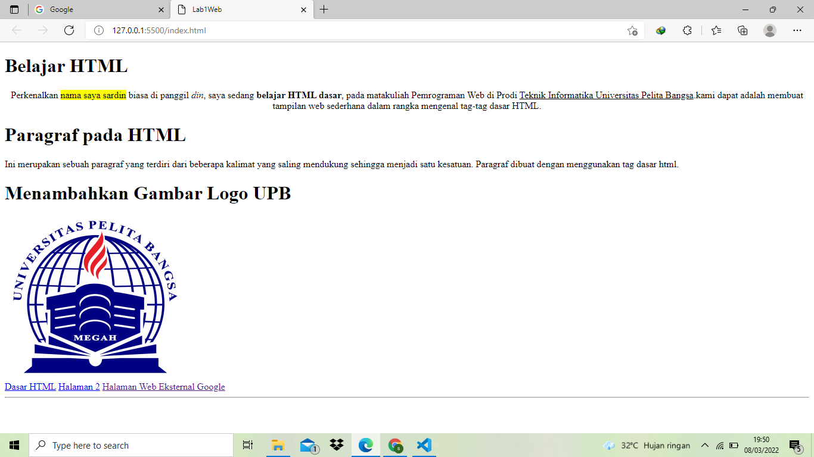

# Tugas2 Pemograman Web 
# Lab1Web
## paragraf
**disini saya menambahksn paragraf dengan keterangan tag "< p >"**

## Heading
**disini saya menambahkan Heading dengan keterangan tag "< h >"**

## Pormat Texs
**disini saya menambahkan pormat Teks dengan keterangan tag " untuk blok warna huruf < span >""untuk huruf tebal < b >""untuk huruf miring < i >""keterangan garis bawah huruf< u >" dan disini saya juga menambahkan Gambar logo UPB dengan menggunakan keterangan Teg "< img >"
**
## HyperLink
**yang terakhir saya disini menambahkan Hyperlink dengan meggunakan Teg"< a href >"**
